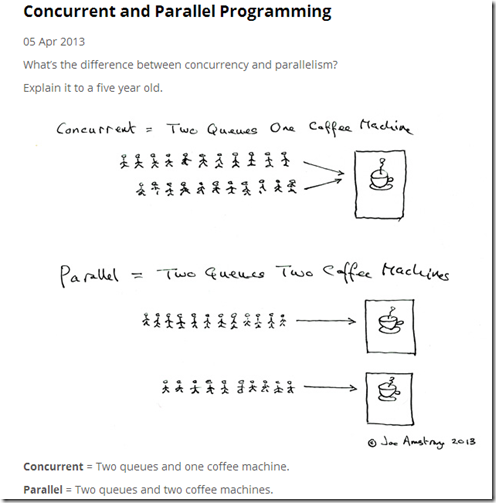
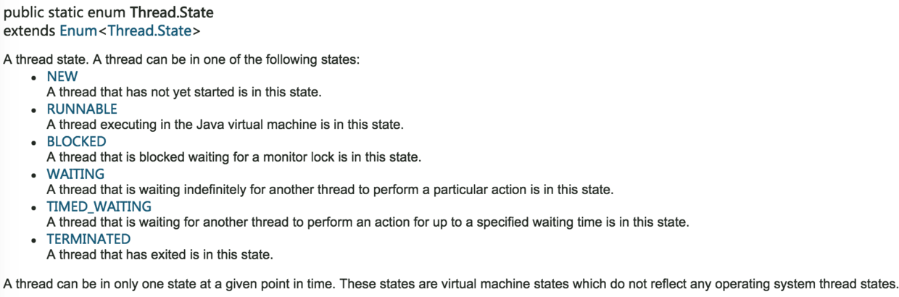
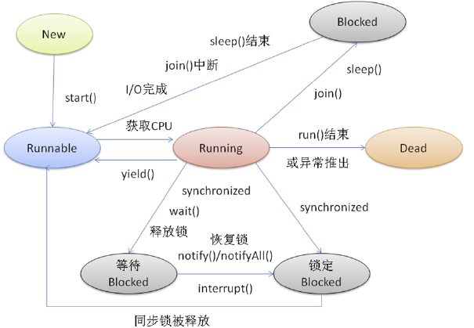

# Java中的多线程

https://www.cnblogs.com/wxd0108/p/5479442.html

## 引

- 多线程:值的是这个程序(一个进程)运行时产生了不止一个线程

- 并行与并发:

  - 并行:多个cpu实例或者多台及其同时执行一段处理逻辑,是真正的同时.

  - 并发:通过CPU调度算法,让用户看上去同时执行,实际上从CPU操作层面不是真正的同时.并发旺旺在场景中有公用的资源,那么针对这个公用的资源往往产生瓶颈,我们会用TPS或者QPS来反应这个系统的处理能力.

    

- 并发与并行

  - 线程安全:经常用来描绘一段代码.指在并发的情况下,该代码经过多线程使用,线程的调度顺序不影响任何结果.这个时候使用多线程,我们只需要关注系统的内存,cpu是不是够用即可.反过来,线程不安全就意味着线程的调度顺序会影响最终结果,如不加事务的转账代码:

    ```java
    void transferMoney(User from,User to,float amount){
        to.setMoney(to.getBalance() + amount);
        from.setMoney(from.getBalance() - amount);
    }
    ```

  - 同步:Java中的同步指的是通过人为的控制和调度,保证共享资源的多线程访问称为线程安全,来保证结果的准确.如上面的代码简单加入`@synchronized`关键字.在保证结果准确的同时,提高性能,才是优秀的程序.线程安全的优先级高于性能.

## 线程的状态



- 线程的状态



- 线程状态的转换
- 线程的blocked状态
  - 线程在Running的过程中可能会遇到阻塞的情况(blocked)
  - 调用join()和sleep()方法,sleep()时间结束或被打断,join()中断,IO完成都会回到Runnable状态,等待JVM的调度
  - 调用wait(),使该线程处于等待池(wait blocked pool),直到notify()/notifyAll(),线程被唤醒被放到锁定池(lock blocked pool),释放同步锁使线程回到可运行状态(Runnable)
  - 对Running状态的线程加同步锁(Synchronized)使其进入(lock blocked pool),同步锁被释放进入可运行状态(Runnable)
  - 在runnable状态的线程是处于被调度的线程,此时的调度顺序是不一定的
  - Thread类中的yield方法可以让一个running状态的线程转入runnable


