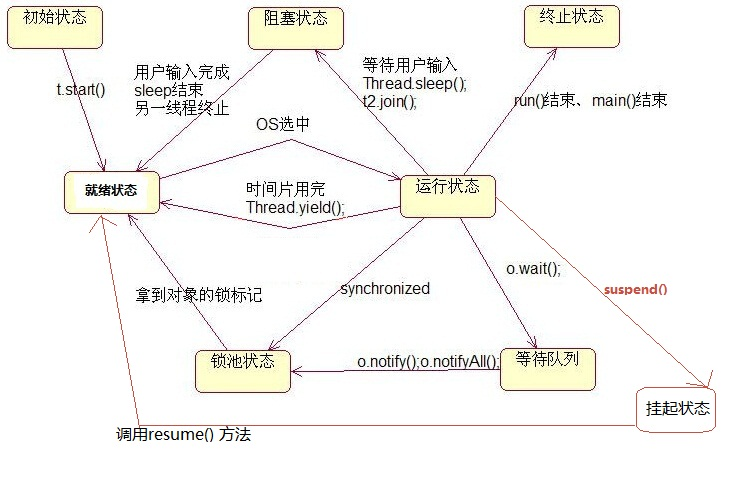

# 线程的几种状态转换

http://www.cnblogs.com/jijijiefang/articles/7222955.html

- 新建状态new:新创建了一个线程对象

- 就绪状态Runnable:线程对象创建后,其他线程调用了该对象的start()方法,该状态的线程位于可运行线程池中,变得可运行,只等待获取cpu的使用权,即在就绪状态的进程除cpu之外,其他的运行所需资源都已全部获得.

- 运行状态running:就绪状态的线程获取了cpu,执行程序代码

- 阻塞状态blocked:阻塞状态是线程因为某种原因放弃cpu使用权,暂时停止运行.知道线程进入就绪状态后,才有机会转到运行状态

  - 阻塞分为三种
  - 等待阻塞:运行的线程执行wait()方法,改线程会释放占用的所有资源,JVM会把该线程放入'等待池'中,进入这个状态后,是不能自动唤醒的,必须依靠其他线程调用notify()或者notifyAll()方法才能被唤醒
  - 同步阻塞:运行的线程在获取对象的同步锁时若该同步锁被别的线程占用,则jvm会把该线程放入'锁池'中
  - 其他阻塞:运行的线程执行sleep()或join()方法,或者发出了i/o请求时,jvm会把该线程置为阻塞状态,当sleep()状态超时,join()等待线程终止或者超时,或者i/o处理完毕时,线程重新转入就绪状态.

- 死亡状态Dead:线程执行完了或者因一场退出了run()方法,该线程结束生命周期

  

- 注:拿到对象的锁标记,即为获得了对该对象(临界区)的使用权限.即该线程获得了运行所需的资源,进入'就绪状态',只需获得cpu,就可以运作.因为当调用wait()后,线程会释放掉它所占有的'锁标志',所以线程只有再次获取资源才能进入就绪状态

## 解释

- 线程的实现有两种方式,一是继承thread类,而是实现runnable接口,但不管怎样,当我们new了这个对象后,线程就进入了初始化状态
- 当该对象调用了start方法,就进入就绪状态
- 进入就绪后,当该对象被操作系统选中,获得cpu时间片就会进入运行状态
- 进入运行状态后就比较复杂了
  - run方法或main方法结束后,线程就进入终止状态
  - 当线程调用了自身的sleep方法或其他线程的join方法,进程让出cpu,然后就会进入阻塞状态(该状态既停止当前线程,但并不释放所占有的资源.即调用sleep函数后,线程不会释放它的'锁标志').当sleep结束或join()结束后,该线程进入可运行状态,继续等待os分配cpu时间片.***典型地,sleep被用在等待某个资源就绪的情形***,测试发现条件不满足后,让线程阻塞一段时间后重新测试,知道条件满足为止.
  - 线程调用了 yield方法,意思是放弃当前获得的cpu时间片,回到就绪状态,这时与其他线程处于同等竞争状态,os有可能会接着又让这个线程进入运行状态;调用yield的效果等价于调度程序认为该线程已执行了足够的时间片从而需要转到另一个线程.***yield只是使当前线程重新回到可执行状态***,所以执行yield的线程有可能在进入到可执行状态后马上又被执行.
  - 

